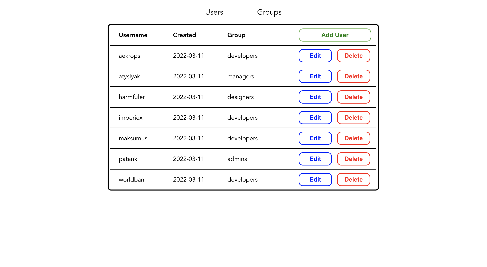
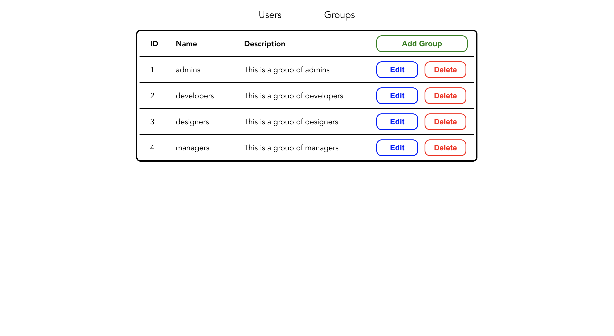

# Test-task-python

## Project description
This is a simple web application to manage(CRUD operations) users and groups of them. Built with React(frontend),
Django(backend) and PostgreSQL(DB)
### Users page:

### Groups page:

---

## Requirements
1. Python (3.8+)
2. Docker + docker compose
---

## How to run
  + Open terminal in folder where you want to store this repository
  + Clone this repository with command `git clone https://github.com/max-dmytryshyn/test-task-python`
  + Go into folder with files with command `cd test-task-python`
  + Run command `docker-compose build` to build images
  + Run command `docker-compose run --rm db` to set up DB
  + After receiving `database system is ready to accept connections` in terminal, press `Ctrl` + `C` to stop process
  + Run command `docker-compose up` to run full application
  + Open http://localhost:3000/
  + Done, now you can operate users and groups as you want
